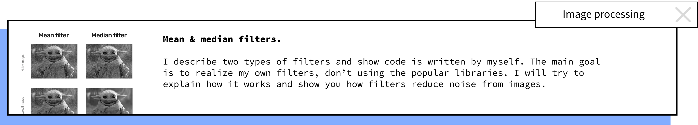
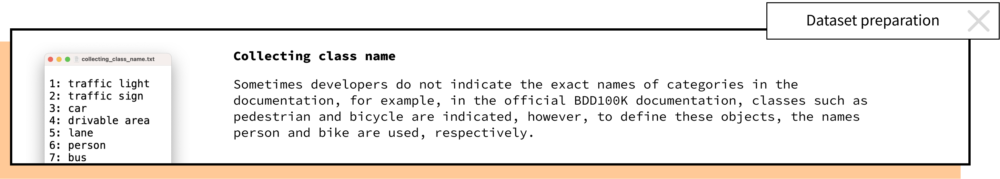
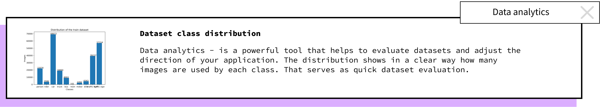
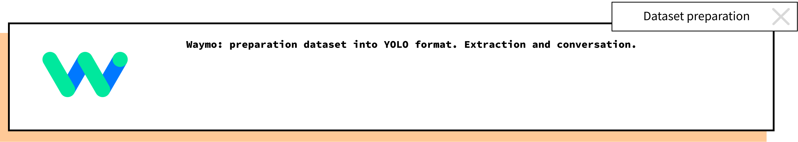
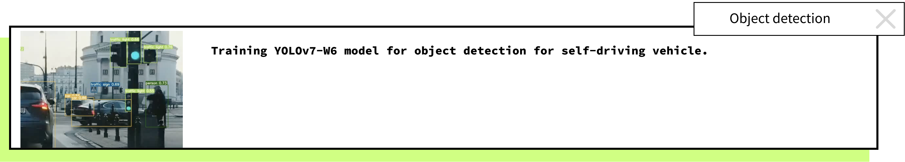

## 👋🏻 Hi there, I’m Evgenii. 
I’m a student at the Warsaw University of Technology. I’m very big on computer vision and machine learning. I stick to philosophy in my life: if you want to know something good, explain it to others. Therefore, I make videos about geometry, ML, CV, and physics and share them on my Instagram profile. Also, you can read my popular scientific articles on Medium. I recommend reading the article "Projective Geometry" with my own illustrations. At university, I give a lecture to a student. I believe in the automation of our world for the benefit of mankind and want to be a part of this future.

## Cases

    <a href="https://medium.com/@iurin.evgenii/image-processing-mean-median-filters-2a444fc2092f"><a/>
    <a href="https://github.com/Evgenii-Iurin/Dataset-preparation/tree/main/Collecting-class-name"><a/>
    <a href="https://github.com/Evgenii-Iurin/Dataset-preparation/tree/main/Class-distribution" style={margin: "px"}><a/>
    <a href="https://github.com/Evgenii-Iurin/Dataset-preparation/tree/main/Waymo-preparation"><a/>
    <a href=""><a/>

 
